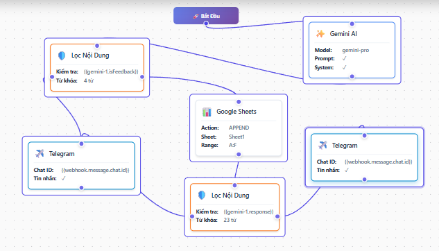

# HƯỚNG DẪN CẤU HÌNH WORKFLOW CHI TIẾT

## 🎯 MỤC TIÊU
- **Câu hỏi bình thường**: Trả lời bằng Gemini AI, KHÔNG lưu Sheets
- **Feedback (đánh giá)**: Lưu vào Google Sheets + Gửi message cảm ơn

---

## ⚙️ CẤU HÌNH TỪNG NODE

### NODE 1: BẮT ĐẦU (Trigger)
- **Type**: Input (tự động có sẵn)
- **Không cần config**
- Output: `webhook` object chứa data từ Telegram

---

### NODE 2: GEMINI AI
**Config:**
- **Model**: `gemini-pro` (MIỄN PHÍ)
- **System Prompt**:
```
Bạn là chatbot tư vấn sản phẩm thông minh.
  
QUY TẮC PHẢN HỒI:
  
1. NẾU tin nhắn là FEEDBACK (có số điểm 1-10, hoặc từ "tốt/tệ/đánh giá/rating"):
   → Trả về JSON (KHÔNG giải thích gì thêm):
   {
     "is_feedback": true,
     "sentiment": "positive hoặc negative hoặc neutral",
     "score": 0-10,
     "original_text": "tin nhắn gốc của user"
   }

2. NẾU là CÂU HỎI bình thường:
   → Đếm số tin nhắn trong conversation history
   → Trả lời câu hỏi
   → NẾU đủ 7 tin nhắn VÀ chưa hỏi đánh giá hôm nay:
      THÊM vào cuối response:
      "---
      ✨ Bạn đánh giá trải nghiệm chat thế nào? (1-10 hoặc feedback tự do)"
   → Trả về: {"is_feedback": false, "response": "câu trả lời của bạn"}

CHỈ hỏi đánh giá 1 LẦN/NGÀY.
```
- **User Message**: `{{webhook.message.text}}`
- **Max Tokens**: `2048`
- **Temperature**: `0.7`
- **☑️ Sử dụng Conversation History**: `CHECKED`
- **Chat ID**: `{{webhook.message.chat.id}}`

**Output variables**:
- `{{gemini-1.response}}` - Text response đã parse
- `{{gemini-1.isFeedback}}` - Boolean: true/false
- `{{gemini-1.rawResponse}}` - JSON gốc
- `{{gemini-1.feedbackData}}` - Object nếu là feedback

---

### NODE 3: LỌC NỘI DUNG #1 (Check if Feedback)
**Config:**
- **Nội dung cần kiểm tra**: `{{gemini-1.isFeedback}}`
  - Click 📦 → Chọn node `gemini-1` → Chọn variable `isFeedback`
- **Từ khóa nhạy cảm** (CHỈ 1 DÒNG):
```
true
```
- **Tin nhắn cảnh báo**: (để trống - không dùng)
- **☐ Phân biệt chữ hoa/thường**: `UNCHECKED`

**Branching logic:**
- **PASS** (không tìm thấy `true`) = Câu hỏi bình thường (isFeedback=false)
- **REJECT** (tìm thấy `true`) = Là feedback (isFeedback=true)

**Output variables:**
- `{{filter-1.passed}}` - Boolean
- `{{filter-1.matchedKeywords}}` - Array

---

### NODE 4: GOOGLE SHEETS
**Chỉ chạy khi**: Filter #1 = REJECT (là feedback)

**Config:**
- **Spreadsheet ID**: `1EaoPKCV9LJld5v5VP9Kcm-06PbiQhoO7pUmTSZIZFxQ`
- **Action**: `APPEND`
- **Sheet**: `Sheet1`
- **Range**: `A:F`
- **Service Account JSON**: (paste JSON service account đầy đủ)
- **Values** (click "Thêm hàng" để tạo 6 cột):

| Cột 1 (Timestamp) | Cột 2 (Username) | Cột 3 (ChatID) | Cột 4 (Message) | Cột 5 (Response) | Cột 6 (Score) |
|-------------------|------------------|----------------|-----------------|------------------|---------------|
| `2025-12-04T21:00:00Z` hoặc `{{webhook.message.date}}` | `{{webhook.message.from.username}}` | `{{webhook.message.chat.id}}` | `{{webhook.message.text}}` | `{{gemini-1.response}}` | `{{gemini-1.feedbackData.score}}` |

**Hoặc dùng JSON format**:
```json
[
  [
    "{{webhook.message.date}}",
    "{{webhook.message.from.username}}",
    "{{webhook.message.chat.id}}",
    "{{webhook.message.text}}",
    "{{gemini-1.response}}",
    "{{gemini-1.feedbackData.score}}"
  ]
]
```

**Output variables:**
- `{{sheets-1.updatedRange}}` - Ví dụ: "Sheet1!A5:F5"
- `{{sheets-1.updatedRows}}` - Number

---

### NODE 5: LỌC NỘI DUNG #2 (Check Sentiment)
**Chỉ chạy sau**: Google Sheets (khi là feedback)

**Config:**
- **Nội dung cần kiểm tra**: `{{gemini-1.rawResponse}}`
  - Click 📦 → Chọn node `gemini-1` → Chọn variable `rawResponse`
- **Từ khóa nhạy cảm** (CHỈ 1 DÒNG):
```
"sentiment": "negative"
```
- **Tin nhắn cảnh báo**: (để trống)
- **☐ Phân biệt chữ hoa/thường**: `UNCHECKED`

**Branching logic:**
- **PASS** (không có negative) = Feedback tích cực
- **REJECT** (có negative) = Feedback tiêu cực

---

### NODE 6: TELEGRAM #1 (Response chính)
**Chạy khi**: 
- Filter #1 = PASS (câu hỏi thường) HOẶC
- Filter #2 = PASS (feedback tích cực)

**Config:**
- **Chat ID**: `{{webhook.message.chat.id}}`
- **Tin nhắn**: `{{gemini-1.response}}`
  - Click 📦 → Chọn `gemini-1` → Chọn `response`
- **Parse Mode**: `Markdown` (hoặc None)

**Output:**
- `{{telegram-1.messageId}}` - ID tin nhắn đã gửi
- `{{telegram-1.sent}}` - Boolean

---

### NODE 7: TELEGRAM #2 (Message feedback tiêu cực)
**Chỉ chạy khi**: Filter #2 = REJECT (feedback tiêu cực)

**Config:**
- **Chat ID**: `{{webhook.message.chat.id}}`
- **Tin nhắn**:
```
✅ Cảm ơn đánh giá của bạn!

Chúng tôi rất tiếc khi bạn chưa hài lòng. Chúng tôi sẽ cải thiện dịch vụ!

✅ Đã lưu phản hồi của bạn: {{sheets-1.updatedRange}}
```
- **Parse Mode**: `None`

---

## 🔗 CÁCH VẼ EDGES (ĐƯỜNG NỐI)

### Từ Bắt Đầu:
1. Kéo từ chấm output "Bắt Đầu" → Thả vào "Gemini AI"

### Từ Gemini AI:
2. Kéo từ chấm output "Gemini AI" → Thả vào "Lọc Nội Dung #1"

### Từ Lọc Nội Dung #1 (2 NHÁNH - QUAN TRỌNG):
3. Kéo từ **chấm PASS** (xanh lá, bên trái) → Thả vào "Telegram #1"
4. Kéo từ **chấm REJECT** (đỏ, bên phải) → Thả vào "Google Sheets"

### Từ Google Sheets:
5. Kéo từ chấm output "Google Sheets" → Thả vào "Lọc Nội Dung #2"

### Từ Lọc Nội Dung #2 (2 NHÁNH):
6. Kéo từ **chấm PASS** (xanh lá) → Thả vào "Telegram #1" (cùng node với bước 3)
7. Kéo từ **chấm REJECT** (đỏ) → Thả vào "Telegram #2"

---

## 📋 CHECKLIST SỬA WORKFLOW HIỆN TẠI

### ✅ Bước 1: Sửa Lọc Nội Dung #1
- [ ] Click node "Lọc Nội Dung #1"
- [ ] **XÓA HẾT** field "Nội dung cần kiểm tra"
- [ ] Gõ: `{{gemini-1.isFeedback}}` (hoặc click 📦 chọn gemini-1 → isFeedback)
- [ ] **XÓA HẾT** field "Từ khóa nhạy cảm"
- [ ] Chỉ ghi 1 dòng: `true`
- [ ] Click "💾 Lưu cấu hình"

### ✅ Bước 2: XÓA edge cũ SAI
- [ ] Click vào đường nối từ "Lọc Nội Dung #1" → "Google Sheets" (đường thẳng hiện tại)
- [ ] Nhấn phím **Delete** hoặc click nút xóa

### ✅ Bước 3: VẼ 2 edges MỚI cho Filter #1
- [ ] Kéo từ **chấm PASS (xanh lá)** của "Lọc Nội Dung #1"
- [ ] Thả vào node **"Telegram"** (node trống bên dưới bên trái)
- [ ] Kéo từ **chấm REJECT (đỏ)** của "Lọc Nội Dung #1"
- [ ] Thả vào node **"Google Sheets"**

### ✅ Bước 4: Kiểm tra Google Sheets node
- [ ] Click node "Google Sheets"
- [ ] Đảm bảo có **1 edge VÀO** từ "Lọc Nội Dung #1 REJECT"
- [ ] Đảm bảo có **1 edge RA** đến "Lọc Nội Dung #2"
- [ ] Kiểm tra config: Action=APPEND, Range=A:F

### ✅ Bước 5: Sửa Lọc Nội Dung #2
- [ ] Click node "Lọc Nội Dung #2"
- [ ] Field "Nội dung cần kiểm tra": `{{gemini-1.rawResponse}}`
- [ ] Field "Từ khóa": **XÓA HẾT**, chỉ ghi 1 dòng: `"sentiment": "negative"`
- [ ] Click "💾 Lưu cấu hình"

### ✅ Bước 6: Kiểm tra edges của Filter #2
- [ ] Đảm bảo có edge từ **PASS** → "Telegram #1"
- [ ] Đảm bảo có edge từ **REJECT** → "Telegram #2"

### ✅ Bước 7: Kiểm tra Telegram nodes
- [ ] Click **Telegram #1**: Tin nhắn = `{{gemini-1.response}}`
- [ ] Click **Telegram #2**: Tin nhắn = (message cảm ơn) + `{{sheets-1.updatedRange}}`

### ✅ Bước 8: SAVE WORKFLOW
- [ ] Click nút **"💾 Lưu Workflow"** ở góc trên phải
- [ ] Đợi thông báo "Workflow saved successfully"

### ✅ Bước 9: Restart services
```powershell
taskkill /F /IM node.exe
cd apps\backend-api ; npm start  # Terminal 1
cd hello-temporal ; npm run dev  # Terminal 2
```

---

## 🎯 TEST CASES

### ✅ Test 1: Câu hỏi bình thường
**Input**: "Bạn là ai?"

**Luồng**:
```
Gemini → {isFeedback: false, response: "Tôi là chatbot..."}
Filter #1: "false" có "true"? → KHÔNG → PASS
→ Telegram #1: "Tôi là chatbot..."
→ KHÔNG LƯU SHEETS ✅
```

**Kết quả mong đợi**:
- Bot trả lời: "Tôi là chatbot tư vấn sản phẩm thông minh..."
- Google Sheets: KHÔNG có dòng mới
- Workflow status: Completed

---

### ✅ Test 2: Feedback tích cực
**Input**: "Tôi đánh giá 9 điểm, dịch vụ tốt"

**Luồng**:
```
Gemini → {isFeedback: true, sentiment: "positive", score: 9}
Filter #1: "true" có "true"? → CÓ → REJECT
→ Google Sheets: LƯU (timestamp, username, chatId, message, response, 9)
→ Filter #2: rawResponse có "negative"? → KHÔNG → PASS
→ Telegram #1: "Cảm ơn đánh giá của bạn! 😊"
```

**Kết quả mong đợi**:
- Bot trả lời: "Cảm ơn đánh giá của bạn!"
- Google Sheets: Có dòng mới với score = 9
- Workflow status: Completed

---

### ✅ Test 3: Feedback tiêu cực
**Input**: "Dịch vụ tệ quá, 2 điểm"

**Luồng**:
```
Gemini → {isFeedback: true, sentiment: "negative", score: 2}
Filter #1: REJECT → Google Sheets (lưu)
Filter #2: có "negative"? → CÓ → REJECT
→ Telegram #2: "Cảm ơn đánh giá... Chúng tôi sẽ cải thiện!"
```

**Kết quả mong đợi**:
- Bot trả lời: "Cảm ơn đánh giá... Chúng tôi sẽ cải thiện!"
- Google Sheets: Có dòng mới với score = 2
- Workflow status: Completed

---

## 🐛 TROUBLESHOOTING

### Vấn đề: Bot không trả lời
**Nguyên nhân**: Thiếu edge từ Filter #1 PASS → Telegram #1

**Giải pháp**: Vẽ lại edge từ chấm PASS (xanh) của Filter #1 → Telegram #1

---

### Vấn đề: Vẫn lưu Sheets cho câu hỏi thường
**Nguyên nhân**: Filter #1 vẫn check `{{gemini-1.response}}` thay vì `{{gemini-1.isFeedback}}`

**Giải pháp**: 
1. Click Filter #1
2. Xóa field "Nội dung cần kiểm tra"
3. Gõ lại: `{{gemini-1.isFeedback}}`
4. Save

---

### Vấn đề: Template variable không resolve
**Ví dụ**: Bot gửi text `{{sheets-1.updatedRange}}` thay vì "Sheet1!A5"

**Nguyên nhân**: Alias mapping sai

**Giải pháp**: Đã fix trong code (workflows.ts line 319-327), restart worker

---

### Vấn đề: Workflow stuck "Running"
**Nguyên nhân**: Old workflows đang retry

**Giải pháp**:
```powershell
taskkill /F /IM node.exe
# Đợi 10 giây
cd apps\backend-api ; npm start
cd hello-temporal ; npm run dev
```

Gửi message MỚI để trigger workflow mới

---

## 📊 SƠ ĐỒ WORKFLOW ĐÚNG

```
┌─────────────┐
│  Bắt Đầu   │
│  (webhook)  │
└──────┬──────┘
       │
       ▼
┌─────────────┐
│  Gemini AI  │
│   gemini-1  │
└──────┬──────┘
       │
       ▼
┌──────────────────┐
│ Lọc Nội Dung #1  │
│ Check isFeedback │
│  filter-1        │
└────┬───────┬─────┘
     │       │
PASS │       │ REJECT
(câu │       │ (feedback)
hỏi) │       │
     │       ▼
     │  ┌────────────────┐
     │  │ Google Sheets  │
     │  │   sheets-1     │
     │  └───────┬────────┘
     │          │
     │          ▼
     │  ┌──────────────────┐
     │  │ Lọc Nội Dung #2  │
     │  │ Check sentiment  │
     │  │    filter-3      │
     │  └────┬───────┬─────┘
     │       │       │
     │  PASS │       │ REJECT
     │       │       │
     ▼       ▼       ▼
 ┌──────────────┐ ┌──────────────┐
 │ Telegram #1  │ │ Telegram #2  │
 │ (response AI)│ │ (cảm ơn neg) │
 └──────────────┘ └──────────────┘
```

---

## ✨ HOÀN THÀNH!

Sau khi làm theo checklist, workflow sẽ:
- ✅ Trả lời câu hỏi bình thường KHÔNG lưu Sheets
- ✅ Lưu feedback vào Sheets + Gửi message phù hợp
- ✅ Phân biệt feedback tích cực/tiêu cực
- ✅ Template variables hoạt động đúng
